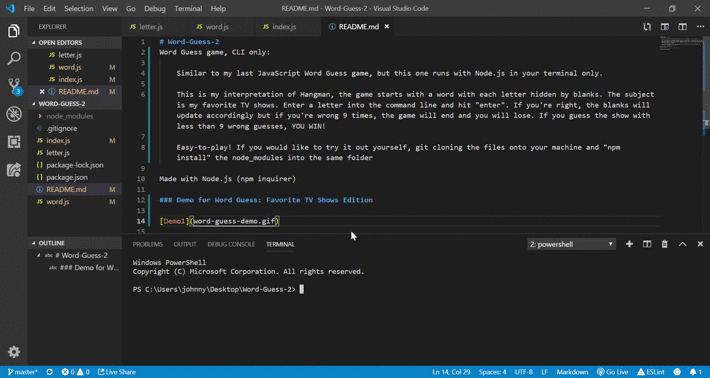

# Word-Guess-2
Word Guess game, CLI only:

Similar to my last JavaScript Word Guess game, but this one runs with Node.js in your terminal only. 

This is my interpretation of Hangman, the game starts with a word with each letter hidden by blanks. The subject is my favorite TV shows. Enter a letter into the command line and hit "enter". If you're right, the blanks will update accordingly but if you're wrong 9 times, the game will end and you will lose. If you guess the show with less than 9 wrong guesses, YOU WIN! 

Easy-to-play! If you would like to try it out yourself, git cloning the files onto your machine and "npm install" the node_modules into the same folder

Made with Node.js (npm inquirer)

### Demo for Word Guess: Favorite TV Shows Edition

